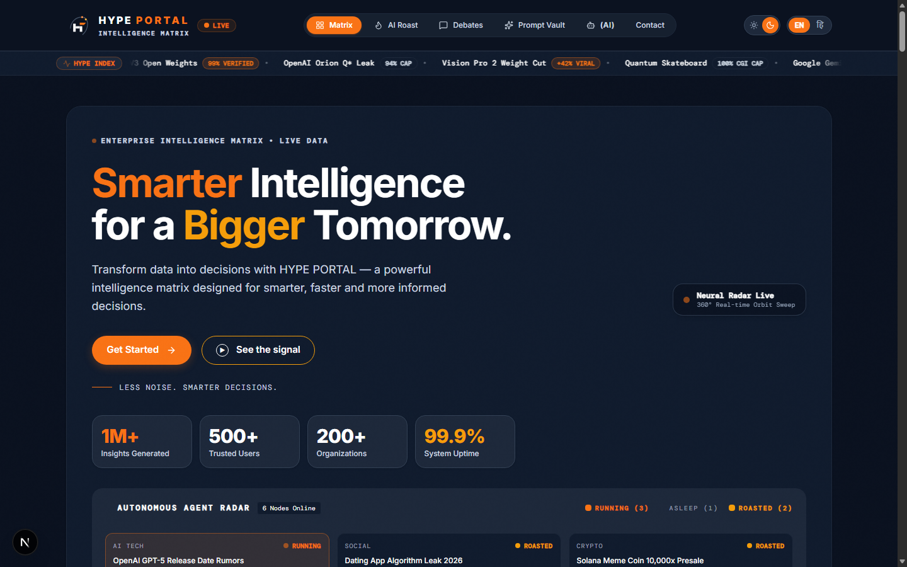
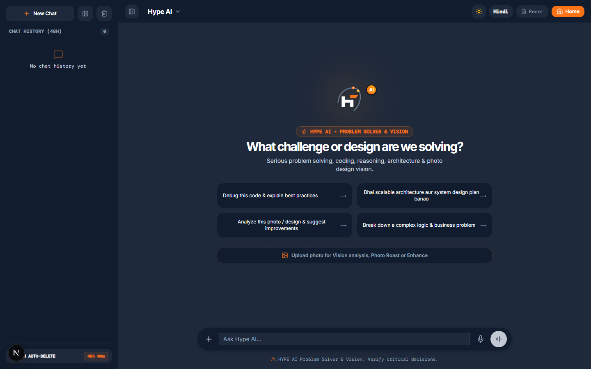
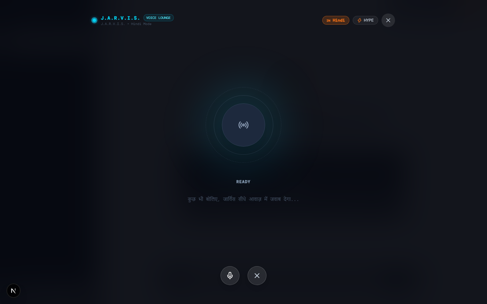
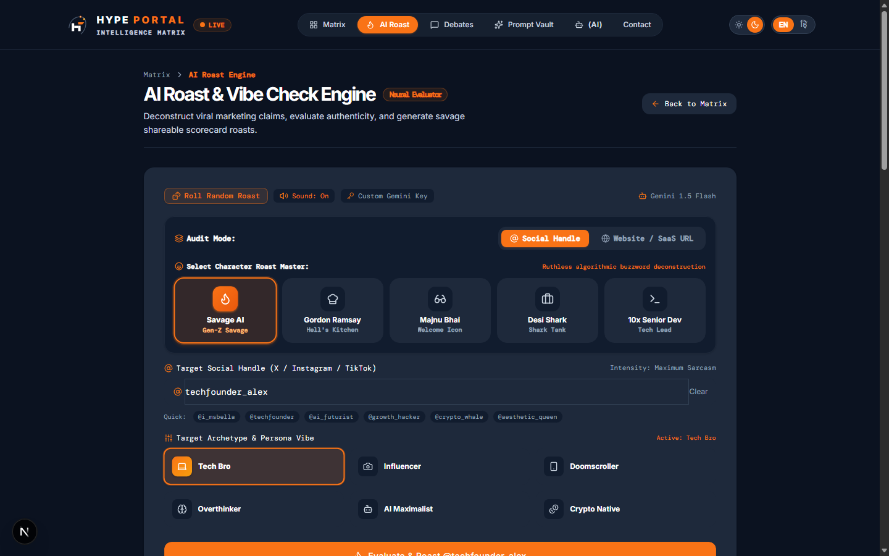
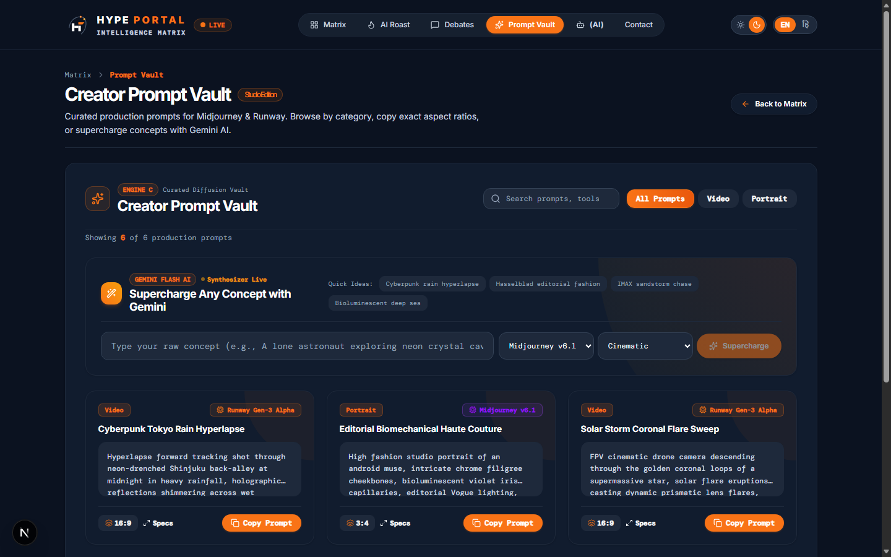

<div align="center">

# ⚡ HYPE PORTAL
### The Next-Gen Interactive AI, Voice & Trend Intelligence Ecosystem

[](https://nextjs.org/)
[](https://react.dev/)
[](https://www.typescriptlang.org/)
[](https://tailwindcss.com/)
[](https://aistudio.google.com/)
[](./LICENSE)

<br />

**Crafted with precision by [Pushkar Sharma](https://github.com/iprceations)**

<p align="center">
  <a href="#-features">Key Features</a> •
  <a href="#-screenshots-walkthrough">Screenshots</a> •
  <a href="#-tech-stack">Tech Stack</a> •
  <a href="#-getting-started">Getting Started</a> •
  <a href="#-project-structure">Project Structure</a> •
  <a href="#-github-deployment">GitHub Setup</a>
</p>

</div>

---

## 🌟 Overview

**Hype Portal** is a cutting-edge, high-performance web platform that merges real-time viral trend discovery with state-of-the-art generative AI. Powered by **Next.js 15**, **React 19**, and **Google Gemini**, Hype Portal delivers:

1. **ChatGPT-Grade AI Workspace** — Featuring dual AI personalities (**Hype AI** for analytical problem-solving and **Roast AI** for unfiltered comedy and brutal critique), verified AI badges, session preservation, and photo studio vision enhancements.
2. **J.A.R.V.I.S. Real-Time Hands-Free Voice Lounge** — A dedicated acoustic HUD featuring an interactive Arc Reactor visualizer and ultra-realistic text-to-speech. Calibrated to the authentic, deep baritone Hindi voice of **Atul Kapoor** (*Iron Man / Avengers* Hindi dub) alongside fluent British/American English voices.
3. **Live Signal Radar & Mindshare Matrix** — Real-time telemetry, interactive debates, viral trend scores, and soundboard audio triggers.

---

## 📸 Screenshots Walkthrough

### 1. 🚀 Home Dashboard & Live Intelligence Radar
*Comprehensive real-time matrix tracking trending signals, sentiment feeds, and community votes.*



---

### 2. 🤖 ChatGPT-Style AI Workspace
*Sleek conversation interface with multi-session history, verified AI badges, prompt starters, and clean pill-style input.*



---

### 3. 🎙️ J.A.R.V.I.S. Voice Lounge HUD (Atul Kapoor Hindi Baritone)
*Hands-free real-time audio chat powered by Edge Neural TTS and interactive Arc Reactor pulse acoustics.*



---

### 4. 🔥 Roast AI Engine & Savage Burn Studio
*Custom unfiltered roaster providing hilariously savage burns, spicy commentary, and meme-grade analysis.*



---

### 5. ⚡ Prompt Vault & Matrix Repository
*Curated library of high-impact AI prompts, system templates, and viral hooks ready to deploy.*



---

## ✨ Key Features

### 🧠 Advanced AI Chat Workspace
- **ChatGPT UI Parity**: Clean floating pill input, expandable text fields, dynamic starters, and smooth autoscroll.
- **Dual Personas**:
  - 🔵 **Hype AI**: Intelligent, structured, respectful, and technical assistant.
  - 🔴 **Roast AI**: Unfiltered, witty, sarcastic, and hilarious roaster.
- **Multimodal Photo Studio**: Upload images directly into the chat, adjust Brightness, Contrast, and Saturation, and receive Gemini-powered visual intelligence.
- **Session Privacy**: Multi-chat history with 48-hour client-side auto-cleanup for privacy.
- **Verified AI Badge**: Distinct verified badge next to the AI avatar.

### 🎙️ J.A.R.V.I.S. Real-Time Voice Lounge
- **Hands-Free Two-Way Voice**: Speak into your microphone and hear J.A.R.V.I.S. reply automatically without typing.
- **Authentic Hindi Voice Calibration**:
  - Calibrated specifically to match **Atul Kapoor's iconic Hindi dub** for *Iron Man* and *The Avengers*.
  - Powered by Microsoft Edge Neural Speech engine (`hi-IN-MadhurNeural`) tuned with custom pitch and rate acoustics (-8Hz / -4% cadence).
- **English Voice Support**: Switch to English for classic British Jarvis styling (`en-GB-RyanNeural`).
- **Cyberpunk Arc Reactor Visualizer**: Dynamic canvas with audio spectrum wave bars and acoustic energy particles.

### 📊 Real-Time Matrix & Interactivity
- **Mindshare Matrix**: Live analytics on what tech, gadgets, and pop-culture trends are popping off.
- **Hype or Cap Community Voting**: Gamified trend predictor with dynamic confetti celebration effects.
- **Desi Soundboard**: Instant comedic audio clips and meme audio responses.
- **Telemetry Stream**: Live simulated terminal logging real-time sentiment signals.

---

## 🛠️ Tech Stack

| Category | Technology |
|---|---|
| **Framework** | [Next.js 15 (App Router)](https://nextjs.org/) |
| **Library** | [React 19](https://react.dev/) |
| **Language** | [TypeScript 5](https://www.typescriptlang.org/) |
| **Styling** | [Tailwind CSS v4](https://tailwindcss.com/) |
| **Generative AI** | [Google Gemini 2.5 Flash / Pro API](https://aistudio.google.com/) |
| **Voice / Neural TTS**| Microsoft Edge Neural TTS (`edge-tts` streaming engine) + Web Speech API |
| **Icons & Effects** | [Lucide React](https://lucide.dev/), Canvas Confetti, HTML-to-Image |
| **Audio Processing** | Web Audio API (Biquad Filter, AnalyserNode, AudioContext) |

---

## 🚀 Getting Started

### Prerequisites

Ensure you have installed:
- **Node.js**: `v18.18.0` or later (Node.js 20+ recommended)
- **npm**, **pnpm**, or **yarn**
- **Python**: `3.10+` (optional, for streaming high-fidelity neural TTS offline)
- A **Google Gemini API Key** (Free from [Google AI Studio](https://aistudio.google.com/app/apikey))

---

### Step-by-Step Installation

#### 1. Clone the Repository
```bash
git clone https://github.com/iprceations/Hype-Portal.git
cd Hype-Portal
```

#### 2. Install Dependencies
```bash
npm install
```

#### 3. Configure Environment Variables
Copy the template environment file:
```bash
cp .env.example .env.local
```

Open `.env.local` and add your Google Gemini API key:
```env
GEMINI_API_KEY=your_gemini_api_key_here
```

#### 4. Run the Development Server
```bash
npm run dev
```

#### 5. Open in Browser
Visit **[http://localhost:3000](http://localhost:3000)** to explore Hype Portal!

---

## 📁 Project Structure

```text
hype-portal/
├── app/
│   ├── ai/               # ChatGPT interface & J.A.R.V.I.S. voice route
│   ├── api/
│   │   ├── chat/         # Gemini API streaming endpoint
│   │   ├── tts/          # Neural TTS voice synthesis API
│   │   └── voice-reply/  # Low-latency voice response generator
│   ├── debates/          # Community debate feeds
│   ├── roast/            # Standalone Roast Engine studio
│   ├── vault/            # Prompt Vault matrix
│   ├── layout.tsx        # Root layout, metadata & providers
│   └── page.tsx          # Homepage with Mindshare Radar
├── components/
│   ├── ChatGptInterface.tsx  # Core AI chat, photo studio & J.A.R.V.I.S. HUD
│   ├── RoastEngine.tsx       # Savage AI burn generator
│   ├── PromptVault.tsx       # Curated prompt engineering gallery
│   ├── SignalFieldRadar.tsx  # Circular telemetry radar
│   ├── DesiSoundboard.tsx    # Audio effects board
│   ├── HypeOrCapGame.tsx     # Gamified community voting
│   └── Navbar.tsx            # Global navigation bar with language switcher
├── docs/
│   └── screenshots/      # High-resolution screenshots used in README
├── public/               # Static assets, branding logos, icons
├── scripts/
│   └── tts_stream.py     # Python Edge TTS streaming helper
├── .env.example          # Sample environment configuration
├── LICENSE               # MIT License
├── package.json          # Project dependencies & scripts
└── tsconfig.json         # TypeScript compiler configuration
```

---

## 🚢 GitHub Deployment & Remote Setup

To publish this project to your own GitHub account:

```bash
# 1. Initialize git (if not already done)
git init

# 2. Set default branch to main
git branch -M main

# 3. Stage and commit files
git add .
git commit -m "feat: initial commit - Hype Portal with J.A.R.V.I.S. Voice Mode & Photo Studio"

# 4. Link your remote repository
git remote add origin https://github.com/iprceations/Hype-Portal.git

# 5. Push to GitHub
git push -u origin main
```

### Deploy to Vercel in 1-Click
The easiest way to deploy Hype Portal to production is using [Vercel](https://vercel.com/):
1. Import your `Hype-Portal` repository into Vercel.
2. In **Environment Variables**, add `GEMINI_API_KEY`.
3. Click **Deploy**.

---

## 🛡️ License

This project is licensed under the **MIT License** — see the [LICENSE](./LICENSE) file for details.

---

## 👨‍💻 Author

**Pushkar Sharma**
- Project: **Hype Portal**
- GitHub: [@iprceations](https://github.com/iprceations)

<div align="center">
  <sub>Built with ❤️, curiosity, and high voltage by Pushkar Sharma.</sub>
</div>
